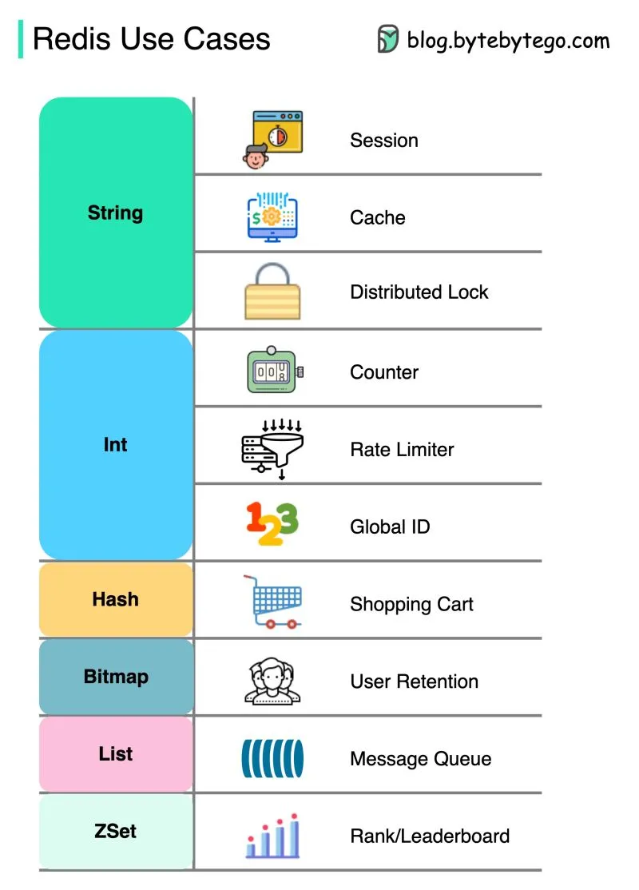
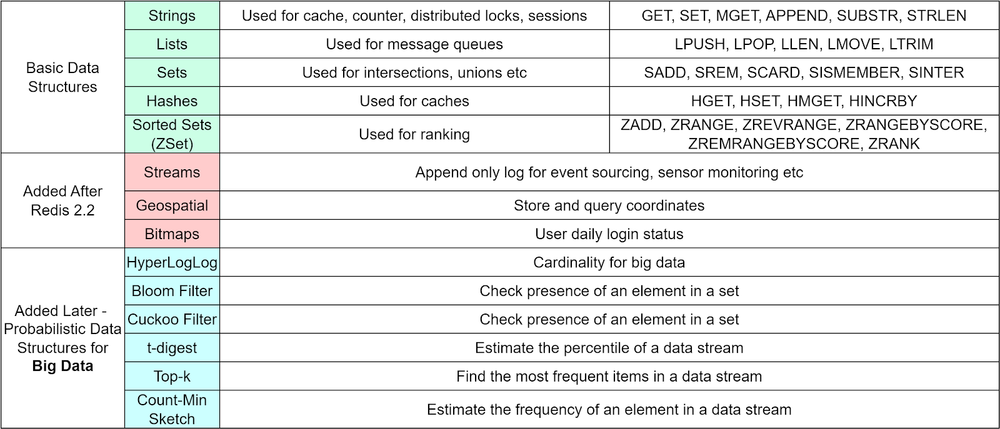

# Redis

- [Redis](#redis)
	- [Зачем](#зачем)
	- [Функции](#функции)
	- [Паттерны](#паттерны)
	- [Deployment](#deployment)
	- [Obervability](#obervability)

## Зачем

Redis - Remote Dictionary Service in __memory__.

- Key Value [хранилище](store.md)
- [Кеширование данных](../arch/ability/performance.md)
- Дедубликация
- Session store
- Distributed lock
- Counter
- Rate limiter
- [Ranking/leaderboard](https://www.youtube.com/watch?v=a4yX7RUgTxI&ab_channel=ByteByteGo)
- TODO
  - [The 6 Most Impactful Ways Redis is Used in Production Systems](https://blog.bytebytego.com/p/the-6-most-impactful-ways-redis-is)
  - [todo](https://blog.bytebytego.com/p/redis-can-do-more-than-caching)
  

## Функции

- [RESP](https://redis.io/docs/reference/protocol-spec/) протокол
- [Аунтентификация по IP, Password](https://netpoint-dc.com/blog/redis-security/)
  - Разграничение доступа по операциям, ключам [Access Control List (ACL)](https://redis.io/docs/management/security/acl/)
  	- support by database RBAC [Redis Enterprise](https://fcerbell.github.io//HowtomanageRBACsecuritywithACLandRole/)
- [Pub\Sub](https://habr.com/ru/post/456270/)
- [Типы данных](https://redis.io/docs/data-types/)
	- List - упорядоченный список, отбор элементов по порядковому номеру или с конца\начала
	- [Streams](https://habr.com/ru/post/456270/) - append-only log
      - Каждая запись имеет уникальный идентификатор. По умолчанию идентификатор генерируется автоматически и включает в себя временную метку.
      - Поэтому вы можете запрашивать диапазоны записей по времени или получать новые данные по мере их поступления в поток, как Unix команда «tail -f» читает лог-файл и замирает в ожидании новых данных.
	- Sets
    	- [lists VS sets](https://hashnode.com/post/differences-between-lists-and-sets-in-redis-ciojr30i401g3lh5364dkoqwv)
	- [Sorted sets](https://redis.io/docs/data-types/sorted-sets/)
	- Hashes
- Redis Sentinel — это сервис, обеспечивающий создание __распределённых систем__
- Redis cluster
- TTL
	- type key-value
	- type Sorted sets ZSet [by timestamp](https://stackoverflow.com/questions/74583970/can-redis-cache-store-the-time-to-live-ttl-for-each-items-in-a-list) clear
- [Транзакции](https://habr.com/ru/post/204354/)
- Поиск
	- [Tag](https://redis.io/docs/stack/search/reference/tags/)
	- Полнотекстовый

## Паттерны

- [Индексирования ключей](https://habr.com/ru/post/485672/)
- [Паттерны индексирования](https://habr.com/ru/post/485672/)
	- Полнотекстовый поиск

## Deployment

- [персистентность](https://redis.io/docs/management/persistence/)
	- [RDB-файлы](https://habr.com/ru/company/wunderfund/blog/685894/)
	- AOF на диск
	- медленно при перезапуске, лучше использовать репликации на резервный сервер
- [HA cluster](https://redis.io/docs/management/scaling/)
	- Оценка [системных требований](https://redis.com/modules/redis-search/redisearch-sizing-calculator/)

[HA нюансы](http://eax.me/redis/):

- когда на серверах Redis`а появляется __дисковая активность, время ответа от нашего сервиса растет__
- На некоторое время мы снизили частоту сохранения данных на диск
- __Redis недоступен__ все время, пока он __поднимает данные с диска__ (это логично, конечно), т.е. если вдруг у вас упал Redis-процесс, то до тех пор, пока вновь поднятый сервис не поднимет все __свое состояние с диска__, сервис отвечать не будет, даже если для вас отсутствие данных гораздо меньшая проблема чем недоступная БД.
- после внедрения __шардинга__ стало слежение за доступностью оперативной памяти на Redis-серверах. Свободной памяти на серверах должно быть столько, чтобы при падении 1-2 Redis-машин нам хватило бы памяти для передачи всех данных на оставшиеся в бою сервера и продолжения работы до тех пор, пока вылетевшие сервера не вернутся в строй.
	- __Персистентность__ в программировании означает способность состояния существовать дольше, чем процесс, создавший его.
- В первую очередь, Redis умеет __сохранять данные на диск__. Можно настроить Redis так, чтобы данные вообще не сохранялись, сохранялись периодически по принципу copy-on-write, или сохранялись периодически и писались в журнал (binlog). Таким образом, всегда можно добиться требуемого баланса между производительностью и надежностью.
- [redis-benchmark](https://redis.io/docs/management/optimization/benchmarks/) в тесте только пускать
	- [memtier](https://www.8host.com/blog/analiz-proizvoditelnosti-servera-redis-na-ubuntu-18-04/)
- [Репликация](https://habr.com/ru/company/wunderfund/blog/685894/)
	- [TODO](https://cloud.github.com/downloads/kondratovich/the-little-redis-book/redis-ru.pdf)

## Obervability

- Metrics
	- Индекс производительности: показатели производительности
		- [latency, instantaneous_ops_per_sec, hit rate (calculated)](https://russianblogs.com/article/7125451930/)
	- Метрики памяти: Метрики памяти
	- Основные показатели деятельности: основные показатели деятельности
		- Cache Hit Ratio
		- [TODO](https://scalegrid.io/blog/6-crucial-redis-monitoring-metrics/)
	- Метрики персистентности: Метрики персистентности
	- Метрики ошибок: Метрики ошибок
- Use Agent [Zabbix](https://habr.com/ru/company/first/blog/687916/)
